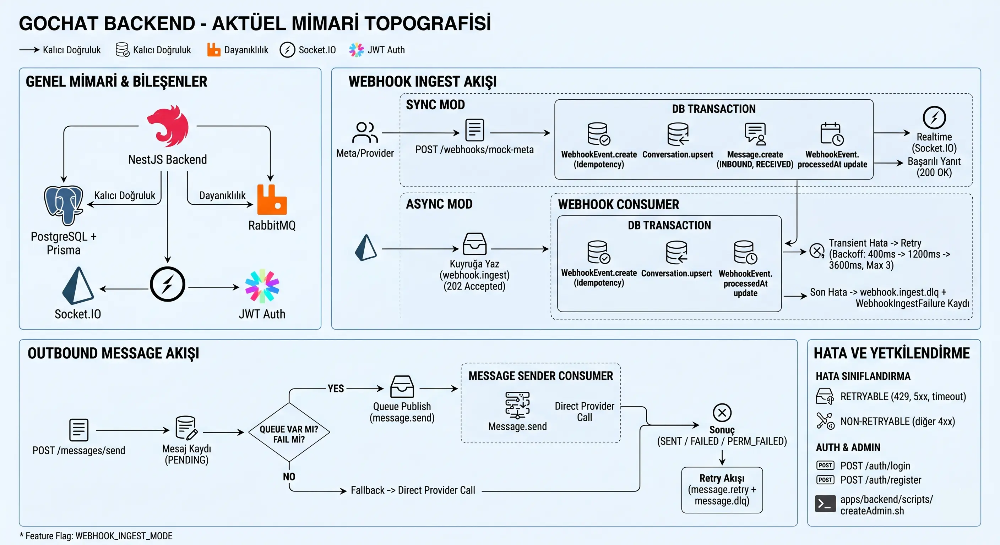

# Omnichannel Messaging Monorepo

<div align="right">
  <a href="README_TR.md">🇹🇷 Türkçe</a>
</div>

<p align="center">
  
  
  
  
  
  
</p>

This repository contains a comprehensive monorepo architecture built with `npm workspaces`, designed for omnichannel messaging and webhook management processes. The project integrates all necessary components seamlessly, ranging from API services to modern web interfaces and mock data providers. The main purpose of utilizing a monorepo structure is to manage multiple related projects within a single repository, thereby streamlining the development lifecycle.

<p align="center">
  
</p>

## Architecture & Components

The project consists of three primary micro-applications located under the `apps/` directory:

- **`apps/backend`**: The core API service of the system. Developed with the NestJS framework, it features PostgreSQL integration for data management and RabbitMQ for asynchronous task queuing.
- **`apps/web-nextjs`**: The primary user interface developed with Next.js, adhering to modern web architecture standards.
- **`apps/mock-meta-provider`**: A test data provider developed to simulate third-party service requests (e.g., Meta) in accordance with the case requirements.

---

## Installation & Setup

Follow the steps below to run the project in your local environment.

First, you need to install all project dependencies:
```bash
npm run bootstrap
```
This command installs dependencies across all workspaces into a shared root directory. It prevents redundant downloading of `node_modules` and significantly reduces disk space usage.

### Development Environment
To facilitate the development process, a single command is sufficient to start all core services (backend, web-nextjs, and mock provider) concurrently with hot-reload support:

```bash
npm run dev
```

*(If you prefer to run a specific service in isolation, you can use `npm run dev:backend` or `npm run dev:web-next` respectively.) The mock stream originates from the `npm run dev:mock` service. It is highly recommended to start this service first.*

### Automated Docker Setup
To spin up the project along with PostgreSQL, RabbitMQ, and all other components in an isolated Docker network:

```bash
npm run up
```
You can use the `npm run down` command to stop the existing containers and release resources.

### Image Build & Docker Hub Deployment
To accelerate CI/CD processes or manual image deployments, the following scripts are integrated into `package.json`:

- **To build all images:** `npm run docker:build:all`
- **To push built images to Docker Hub:** `npm run docker:push:all`

---

## Service Endpoints

Once the applications are running, you can access the respective services at the following addresses:

- **Backend API:** `http://localhost:3000`
- **Swagger API Documentation:** `http://localhost:3000/api`
- **Next.js Interface (Main Frontend):** `http://localhost:5180`
- **Nginx Proxy Manager:** `http://localhost:81`
- **Mock Provider API:** `http://localhost:4000`
- **RabbitMQ Management UI:** `http://localhost:15672` *(User: admin / Pass: test_rabbitmq_pass_xyz)*

---

## Quality Assurance & Testing

The following test procedures are configured to verify system stability and performance:

- **End-to-End (E2E) Tests:**  
  `npm run test -w @sempeak/backend`
  
- **Smoke Tests:**  
  `./apps/backend/scripts/smoke-test.sh`
  
- **Webhook Load Test:** *(Measures the processing capacity of 5000+ concurrent webhook requests)*  
  > ⚠️ **Note:** It is strongly recommended to run this test in a separate, isolated database to avoid affecting your existing data. To configure the test environment, you can update the `DATABASE_URL` variable in the `docker-compose-test.yml` file under the `apps/backend` directory according to your test database.
  
  ```bash
  npm run test:load:webhook -w @sempeak/backend
  ```

  <details>
  <summary><b>Performance Summary (5000 Requests)</b></summary>
  
  Thanks to the NestJS architecture and the asynchronous message queue infrastructure, **5000** incoming webhook messages (**100 concurrency**) from third-party channels were processed within seconds without any data loss (100% success rate). The system achieved a performance of **~2400 requests per second (throughput)** with an average latency of **40ms**.

  ```text
  --- Result ---
  Completed     : 5000
  Success       : 5000
  Failed        : 0
  Success rate  : 100.00%
  Duration      : 2.09s
  Throughput    : 2396.59 req/s
  Avg latency   : 40.41 ms
  P50 latency   : 23.16 ms
  P95 latency   : 35.20 ms
  P99 latency   : 876.08 ms
  ```
  </details>

---

## 🚀 Roadmap & Future Improvements

In the next phase of the project, considering a true production environment, the following features are planned to be added:

- [x] **Secure Message History & Pagination:** Serving high-volume historical messages on the UI securely and performantly using robust pagination mechanisms to prevent system overload.
- [ ] **Advanced Retry & Dead Letter Queue (DLQ) Management:** A mechanism to isolate messages that have reached their automatic retry limit (e.g., 3 attempts) and fallen into a `FAILED` state, allowing administrators to manually re-queue and dispatch them directly from the UI.
- [ ] **Monitoring & Observability:** Integration of **Prometheus and Grafana** to monitor system bottlenecks and message queue statistics in real-time.
- [ ] **Multi-Tenant Architecture:** Extending the system to serve multiple brands or departments (Tenants) in an isolated manner on the same database (SaaS model).
- [ ] **Department-Based Smart Routing & Lead Management:** Automatically routing incoming messages to specific department agents and converting these conversations into tracking-enabled Lead structures.
- [ ] **Customer Relationship Management (CRM) Module:** Registering users from incoming messages into a dedicated "Customers" panel, allowing centralized management of their information and conversation history.
- [ ] **Spam Prevention & Message Deduplication:** Filtering and dropping repetitive or meaningless (spam) messages sent consecutively by the same user within a short time frame, preventing unnecessary queue loads (using Rate Limiting & Redis).
- [ ] **Out-of-Hours AI/NLP Chatbot Integration:** Integrating an AI assistant with Natural Language Processing (NLP) capabilities to automatically handle and respond to customer messages outside of regular working hours.
